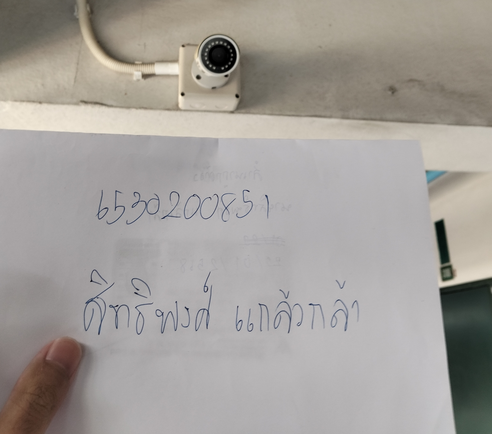

<body>
    

        <h1>🔒 Security Control</h1>
        
        

            
📍 กล้อง CCTV

            
<b>สถานที่:</b> หอใน ม.เกษตรศาสตร์ ศรีราชา

            
<b>🔍 Control Function:</b> Detective

            
<b>🛡️ Type of Security Control:</b> Physical Control

            
<b>❓ ทำไมกล้อง CCTV จึงเป็น Physical Control ประเภท Detective?</b>

            
📸 กล้อง CCTV ใช้สำหรับ ตรวจจับและบันทึกเหตุการณ์ ที่เกิดขึ้นที่ผ่านกล้องจึงเป็นPhysical Control โดยสามารถนำมาใช้เป็นหลักฐานหรือช่วยในการสืบสวน <b>หลังจาก</b> เกิดเหตุการณ์ผิดปกติหรือภัยคุกคามขึ้นแล้วจึงเป็น Detective

            
❌ <b>ไม่ได้ช่วยป้องกัน</b> ไม่ให้เกิดเหตุการณ์ผิดปกติโดยตรง แต่ช่วยเพิ่มความปลอดภัยผ่านการเฝ้าระวังและตรวจสอบ

        

        

            📎 <a href="https://6530200851.github.io" target="_blank">myProfile</a>
        

    

</body>
